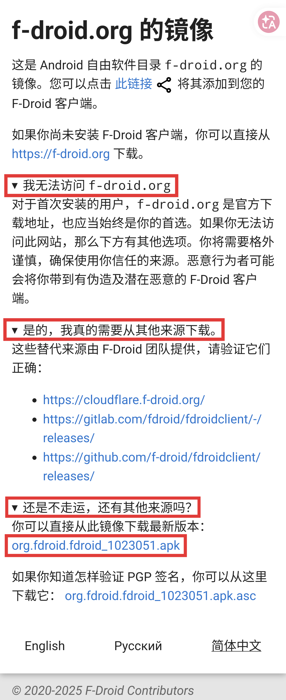
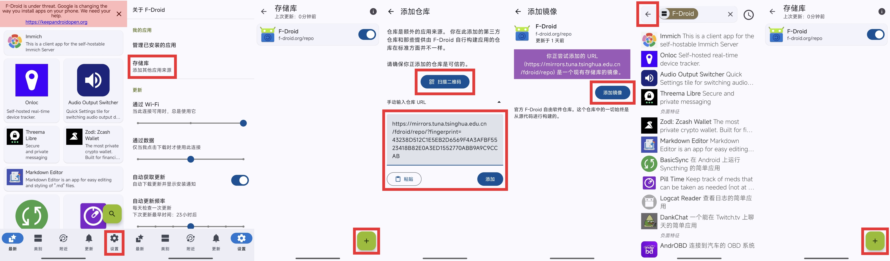
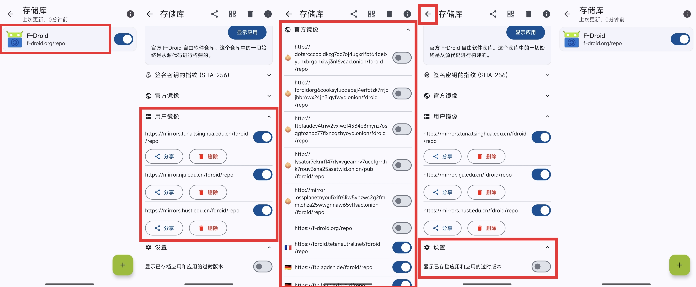
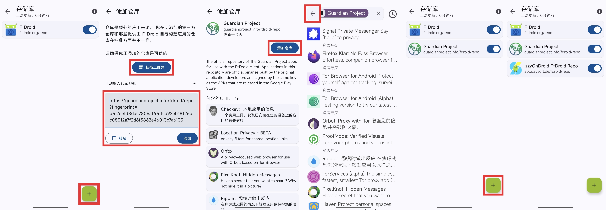
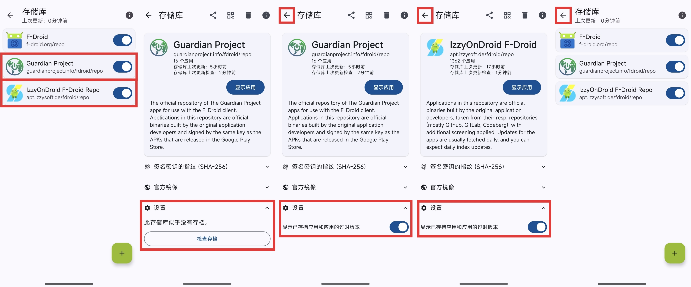
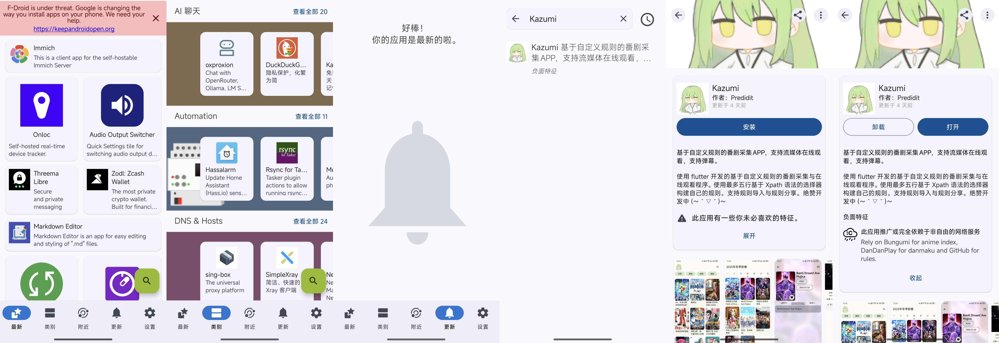

## F-Droid 应用商店使用教程

(Updated: 2026-04-16 by setani.top)

License说明: 本文档以 [CC0](https://creativecommons.org/publicdomain/zero/1.0/) 协议发布。F-Droid 客户端项目由 F-Droid 团队以 [GPL-3.0-or-later](https://www.gnu.org/licenses/gpl-3.0.zh-cn.html) 开源，服务端项目以 [AGPL-3.0-or-later](https://www.gnu.org/licenses/agpl-3.0.zh-cn.html) 开源，项目文档和图标根据作者和使用类别，分别以 [CC BY 3.0](https://creativecommons.org/licenses/by/3.0/) 和 [CC BY 4.0](https://creativecommons.org/licenses/by/4.0/) 发布，且著作权和商标权归属各自作者或组织。文档仅用于技术交流，作者与 F-Droid 官方无利益相关。

文档作者联系方式: 邮箱:  `little_stejan@hotmail.com` ；Telegram: [QyJ_ @Setanio](https://t.me/Setanio "QyJ_") 。

---

### 目录
- [F-Droid 应用商店使用教程](#f-droid-应用商店使用教程)
  - [目录](#目录)
  - [F-Droid 简单介绍](#f-droid-简单介绍)
  - [F-Droid 的优势（和不足）](#f-droid-的优势和不足)
    - [“小而美”的应用](#小而美的应用)
    - [开发者们的“后花园”](#开发者们的后花园)
    - [内容“触手可及”的互联网形态](#内容触手可及的互联网形态)
  - [F-Droid 的下载](#f-droid-的下载)
  - [F-Droid 源的添加](#f-droid-源的添加)
    - [添加中国大陆镜像源](#添加中国大陆镜像源)
    - [添加第三方库](#添加第三方库)
  - [F-Droid 安装和更新应用](#f-droid-安装和更新应用)
  - [我推荐的 F-Droid 应用](#我推荐的-f-droid-应用)

---

### F-Droid 简单介绍

<h1 align="center">
  
</h1>

F-Droid 是一个 Android 平台上历史悠久的 FOSS（自由及开源软件）应用商店。所有在 F-Droid 中上架的软件全部是开放源代码的，且严禁包含恶意追踪或广告组件。

而且更具体地说，你在 F-Droid 官方库上下载的所有软件，是由 F-Droid 官方亲自从开发者处自动获取源代码，按照开发者设定的流程编译出程序安装包（编译的意思大致就是将源代码变成软件）后，上架到商店的。因此可以确保这些程序没有被开发者私自植入恶意代码或广告插件。

当然，上述过程肯定是自动化的。截至 2026-04-16 ，F-Droid 官方库有 4250 个应用。软件开发者上架或更新应用后，F-Droid 不可能人力亲自执行这么多程序的编译流程。因此，除了审核应用之外，获取更新版本、获取代码、编译和发布等都是自动化的。

同时，由于使用了开发者提供的规范编译流程、指令和环境， F-Droid 提供的安装包内容应与开发者在其它地方提供的安装包、以及其他用户按流程自行编译的安装包等应完全一致。这样的条件和产物被称为可重复构建 (Reproducible Builds) 。

F-Droid 官网（中国大陆需要使用 VPN 访问）: https://f-droid.org

关于 FOSS 自由和开源软件的介绍，我贴出以下文章，供您参考。这篇文章的重点不在于介绍自由和开源软件的概念，而是教您 F-Droid 的独特优势，以及在中国大陆如何灵活使用 F-Droid。

- GNU 哲学相关: https://www.gnu.org/philosophy/essays-and-articles.htm
  - 自由软件: https://www.gnu.org/philosophy/free-sw.html
  - "Free"在这里不等于“免费”: https://www.gnu.org/philosophy/selling.html
    - （比如你卖一个里面有 "Free Software"（自由软件）的U盘给他人，你当然可以对U盘收费——因为U盘本身有成本。"Free Software" 同样给予收费的自由。）
  - “自由”“开源”等词的区别: https://www.gnu.org/philosophy/categories.html
  - 著“佐”权: https://www.gnu.org/licenses/copyleft.html
    - （F-Droid 机器人身上反着写的版权符号）
  - 开源许可证: https://www.gnu.org/licenses/license-list.html
- GPL 之殇: https://book.bsdcn.org/fan-yi-wen-zhang-cun-dang/2025-nian/the-problems-with-the-gpl
  - BSD 许可证的问题: https://www.gnu.org/licenses/bsd.zh-cn.html
- 如何选择开源许可证 ~~（这图小时候抱过我）~~ : https://www.ruanyifeng.com/blog/2011/05/how_to_choose_free_software_licenses.html

（不多写了，下次更新再补充，免得跑题）

---

### F-Droid 的优势（和不足）

#### “小而美”的应用

正是由于 F-Droid 官方库的应用均是开源的构建，很多个人开发者或小型组织都会考虑在其中发布自己的应用。这些应用不仅简单易用、小巧轻量，而且审美在线。您在这些应用中的体验，可能会在当今大厂应用中截然不同: 将各种功能全塞在一个应用中，一屏100个功能。“大而全”的背后，不仅是各种用不到的功能眼花缭乱，软件整体在手机中就占了几GB。

同时，这些应用也许能为你的需求，提供虽然小众但有着独特惊喜的方案。在主流环境中，有些需求或想法已经有了主流的解决方案，但你可能觉得这些方案不适合你；也有些需求由于关注的人较少，或者很多人用不到而比较冷门。无论如何，你都可以来 F-Droid 中碰碰运气。

当然，绝大多数情况下，F-Droid 不能替代你设备中的厂商应用商店和 Google Play 商店。F-Droid 官方库中的应用均为开源这一特性，决定了其中的应用并不全面，你不太能从中获得你日常需要的全部应用。因此，我的实用建议是，将 F-Droid 与其他应用商店作为互补，根据您对需要的软件的应用场景，将其中一个应用商店作为首选，其他的作为备选来使用。

我会在最后一章列出我推荐的和我正使用的 F-Droid 中的应用，帮助您完善对应用商店和对开源应用的理解。

---

#### 开发者们的“后花园”

中国大陆常规的应用商店上架流程，对于许多个人开发者是一个难题。如果你需要在诸如华为、小米、oppo、vivo应用商店等上架自己的应用，通常需要以下步骤: 

1. 申请应用软件著作权证书，通常需要寻找[相关机构](https://www.ccopyright.com/index.php?optionid=1057)或公司处理。
2. 选择国内的云服务，购置域名和服务器，然后对域名（+服务器）和你的应用进行[备案](https://help.aliyun.com/zh/icp-filing/basic-icp-service/getting-started/quick-sta-rt-for-icp-filing-for-personal-app)。
3. 将备案材料和著作权材料提交给应用商店后上架。

虽然官方指出，备案仅限于需要联网的应用。但实际操作中，无论你的应用是否联网，上架应用商店仍然需要这两个材料（见下文引用），并且应用安装器的备案检测一般不会以软件是否联网为前提。

所以，上述步骤对普通开发者有时是很严重的阻碍: 这些开发者通常需要一个域名（ baidu.com , bilibili.com 这种就是域名），最便宜的域名之一（*.top）在大陆一年（2026-04-16）35元左右，服务器的价格只会更高（例如有些一年99元的最便宜款，但很多只给两年，而且网络只有 3M ，基本不能用），加上著作权证书的价格（这个要么没有，要么也不太贵），对一些开发者是额外的负担——因为你的应用可能完全不需要它们。

当然，价格上的负担其实只是其中的一小部分，其他例如小米应用商店不接受个人开发者应用，只接受经企业备案的应用等，也都是或明或暗的坑。

> [《小米应用商店上架要求》](https://dev.mi.com/xiaomihyperos/documentation/detail?pId=1322) 中: 
> 
> 2. 基础通用资质要求:
> - 应用发布上架，需提供法规要求的《计算机软件著作权证书》或（《APP电子版权认证证书》）以及ICP证明。
> - 应用发布上架，需提供法规要求的有效ICP证明，ICP备案主体需与所提交的开发者企业信息保持一致。
> 
> [《小米应用商店暂不收录类应用》](https://dev.mi.com/xiaomihyperos/documentation/detail?pId=1354) 中: 
> 
> 24. 个人开发者身份发布的APP 

F-Droid 这一类应用商店，可以作为这类软件和开发者们的另一个选择——提供一个方便的全球化的平台，收录这些在官方应用商店中因各种原因难以上架的应用。在这里，您也许不再需要翻遍网上的各个角落，就能快速找到它们并下载安装。同时也能帮助更多的开发者推广自己的应用，让大家“用爱发电”的心血能更多更好地方便到身边的人。

---

#### 内容“触手可及”的互联网形态

F-Droid 应用商店在大陆当然没有合规的运营资质，因此 GFW（墙）屏蔽了 F-Droid 的官网。你可以尝试使用 VPN 访问 F-Droid，但我下面介绍的 F-Droid 特性，同样作为 F-Droid 最大的特性之一，很好地解决了这个问题。

F-Droid 官方的软件仓库，全球有几十个镜像站（也就是一些大学、组织和机构选择将官方的软件库复制，并且始终与官方站同步内容，然后对外提供），用户可以选择通过其他镜像站下载程序。这不仅减少了对官方站的压力，更能为用户提供更快的下载速度。在中国大陆，这也有效解决了 F-Droid 官方站无法连接的问题。

同时，F-Droid 也可以添加其他非官方软件库。第三方软件库可以拓展应用的来源，让您能下载到其他更多优秀好用的开发者作品。一些非官方库中出现但也很好用的软件，我也会在下面列出。

以上两点，共同诠释了 F-Droid 最大的特征: 去中心化。即使哪个源（甚至官方的源）突然似了，你也能下载到应用。

---

### F-Droid 的下载

请注意: 无论您身处哪里，以下所有的步骤（包括 F-Droid 的下载、安装、库和镜像的配置、软件的下载安装等）完全不需要任何 VPN 。这就是 F-Droid 的一大魅力。

如果您不在中国大陆，请直接打开 https://f-droid.org ，点击“下载 F-Droid ”按钮，即可下载并安装 F-Droid.apk 安装包。

如果您在中国大陆，请通过下述三个镜像源之一，下载 F-Droid (本章结尾有以下链接对应的二维码): 
- 清华大学 F-Droid 镜像源: https://mirrors.tuna.tsinghua.edu.cn/fdroid/repo/?fingerprint=43238D512C1E5EB2D6569F4A3AFBF5523418B82E0A3ED1552770ABB9A9C9CCAB
- 南京大学 F-Droid 镜像源: https://mirror.nju.edu.cn/fdroid/repo/?fingerprint=43238D512C1E5EB2D6569F4A3AFBF5523418B82E0A3ED1552770ABB9A9C9CCAB
- 华中科技大学 F-Droid 镜像源: https://mirrors.hust.edu.cn/fdroid/repo/?fingerprint=43238D512C1E5EB2D6569F4A3AFBF5523418B82E0A3ED1552770ABB9A9C9CCAB

另外，您也可以使用以下链接。服务器会根据网络状况，智能跳转到中国大陆某个大学镜像源（很有可能是清华源）: 
- https://mirrors.cernet.edu.cn/fdroid/repo/?fingerprint=43238D512C1E5EB2D6569F4A3AFBF5523418B82E0A3ED1552770ABB9A9C9CCAB

**（请注意: 该链接不能作为 [#F-Droid 源的添加](#f-droid-源的添加) 一章中的源添加）**

请选择上方列出的某个镜像源链接，将其复制到浏览器打开（建议您使用夸克，但如果您有 Chrome、Edge、Firefox，请优先选择）。如果网页能正常打开，且标题为《f-droid.org 的镜像》(mirror of f-droid.org) ，请在网页中依次点击: 
- 右下角的“简体中文”（如果需要）
- 我无法访问 `f-droid.org` (*Click here if https://f-droid.org is not working*)
- 是的，我真的需要从其他来源下载。 (*Yes, I really need alternate sources to download from.*)
- 还是不走运，还有其他来源吗？ (*Still no luck, any other sources?*)

然后点击“你可以直接从此镜像下载最新版本 (You can download the latest version directly from this mirror) ”一旁的蓝色超链接 (org.fdroid.fdroid_xxx.apk) 下载安装包，然后安装。

    
     
    ▲ 镜像站下载 F-Droid 安装包步骤 

如果无法打开网页，或者无法下载安装包，请换用其他镜像源链接尝试。

以下是上方几个镜像源链接的二维码: 

    
     
    ▲ 以上镜像源从左到右依次为: 清华源、南大源、华科源 

### F-Droid 源的添加

#### 添加中国大陆镜像源

如果您不在中国大陆，您可以跳过这一步，因为 F-Droid 自带的所有官方库的源通常已经能够稳定的满足您的使用需求。添加中国大陆的镜像源，通常不会对您的软件下载速度有提升。

如果您在中国大陆，或者您不在中国大陆但当地有更好的源可供添加，请执行以下步骤: 

    
     
    ▲ F-Droid 添加镜像源步骤 

- 打开 F-Droid，如果出现提示，请允许 F-Droid 读取已安装应用列表和发送通知。
- 在主页面中，点击菜单栏右下角的“设置”。
- 点击“存储库”。
- 点击右下角的“+”号添加仓库。
- 回到 [#F-Droid 的下载](#f-droid-的下载) 一章，根据不同情况添加源: 
  - 如果您使用其他设备观看该教程，可以点击“扫描二维码”，然后扫描其中一个镜像源的链接二维码。
  - 如果使用 F-Droid 和查阅本文的是同一设备，请复制其中一个镜像源的链接，回到 F-Droid 中，点击“手动输入仓库 URL”，粘贴链接到文本框，然后点击右下角“添加”。
- 等待加载完毕后，点击“添加镜像”。
- F-Droid 会跳转到软件搜索页，点击左上角的左箭头返回到存储库。
- 重复上述步骤。点击“+”号，继续添加镜像源。至少选择两个源进行添加，推荐您添加三个源。 **（注: 不要添加域名为 mirrors.cernet.edu.cn 的链接）**
- 如果加载镜像源时遇到错误，请更换 WLAN 或移动网络再试。如果多次尝试仍无法添加，请在浏览器中访问镜像源链接。如果网页能正常打开，且标题为《f-droid.org 的镜像》(mirror of f-droid.org) ，请再次重新尝试连接网络。若无法打开网页或提示404，请弃用该镜像源。

    
     
    ▲ F-Droid 启用和关闭镜像源步骤 

镜像源全部添加完毕后，请回到“存储库”界面，点击"F-Droid"，然后先点击“用户镜像”，查看您添加的源是否已列出并启用。若未启用，请点击右侧开关启用，若未列出，请返回并重新添加源。

之后，如果您在中国大陆，请点击上方的“官方镜像”，从中找到" https://f-droid.org/repo " ，将其右侧按钮关闭以禁用该库，防止 F-Droid 尝试多次重连。同时，请关闭所有左侧为“洋葱”(🧅)的".onion"镜像。

然后，请点击页面下方的“设置”。如果您有需要，可以打开“显示已存档应用和应用的过时版本”。

最后，点击左上角的左箭头返回到存储库列表。

#### 添加第三方库

这里我推荐两个第三方库，以下是它们的链接和链接二维码: 
- Guardian Project: https://guardianproject.info/fdroid/repo?fingerprint=B7C2EEFD8DAC7806AF67DFCD92EB18126BC08312A7F2D6F3862E46013C7A6135
- IzzyOnDroid F-Droid Repo: https://apt.izzysoft.de/fdroid/repo?fingerprint=3BF0D6ABFEAE2F401707B6D966BE743BF0EEE49C2561B9BA39073711F628937A

    
     
    ▲ 以上第三方库从左到右依次为: Guardian Project, IzzyOnDroid 

如果您有其他第三方库的链接或二维码，也可以一并添加。

如果您不在“存储库”页面下，请回到主页面，点击菜单栏右下角的“设置”，找到“存储库”来到存储库列表。

然后，请按下方流程添加仓库: 

    
     
    ▲ F-Droid 添加第三方库步骤 

- 点击右下角的“+”号添加仓库。
- 根据您当前的情况，选择一种方法添加源: 
  - 如果您使用其他设备观看该教程，可以点击“扫描二维码”，然后扫描其中一个存储库的链接二维码。
  - 如果使用 F-Droid 和查阅本文的是同一设备，请复制其中一个仓库的链接，回到 F-Droid 中，点击“手动输入仓库 URL”，粘贴链接到文本框，然后点击右下角“添加”。
- 等待加载完毕后，点击“添加仓库”。
- F-Droid 会跳转到软件搜索页，点击左上角的左箭头返回到存储库。
- 重复上述步骤。点击“+”号，继续添加其余仓库。

仓库全部添加完毕后，请回到“存储库”界面。检查您的第三方库是否已全部添加。

请点击您添加的第一个第三方库，点击“设置”-“检查存档”。进度条加载完毕后，确认“显示已存档应用和应用的过时版本”是否已打开（如有），然后点击左上角的左箭头返回。重复上述步骤，将所有第三方库的显示存档功能打开（如有）。

    
     
    ▲ F-Droid 显示存档应用步骤 

另外，如果您有第三方库的第三方镜像源，也可以按上述方法添加。

最后，点击左上角的左箭头，返回到设置页面。

### F-Droid 安装和更新应用

打开 F-Droid，进入主页面，如果出现提示，请允许 F-Droid 读取已安装应用列表和发送通知，然后先向下滑动屏幕更新存储库。

您可以从设备顶部（的左侧）向下滑打开通知中心，F-Droid 会以通知的形式显示更新进度。通常情况下，单个存储库应在3分钟内更新完毕。如果您发现进度条进度异常缓慢，请您先考虑再刷新一次。如果报错，可以查看报错提示，然后修正问题并刷新。您也可以考虑根据情况，关闭相应功能: 
- 如果在 " https://f-droid.org/repo " 处长时间卡顿或报错，您可以回到“存储库”页面，打开 F-Droid 的仓库，关闭“官方镜像”下的部分或全部镜像，保留“用户镜像”（前提是您有添加用户镜像）。
- 如果在 " https://f-droid.org/archive " 处长时间卡顿或报错，您可以回到“存储库”页面，打开 F-Droid 的仓库，关闭“设置”下的“显示已存档应用和应用的过时版本”。
- 如果在其他第三方库处长时间卡顿或报错，您可以回到“存储库”页面，关闭您不需要的第三方库，或者您也可以添加第三方库的第三方镜像源。

另外，如果关闭一部分镜像后，下载或更新应用时出现404错误，说明目前启用的这些镜像没有同步最新的数据，您可以稍后等待镜像站同步完成后再试。（中国大陆镜像站的同步频率一般为24小时一次）

无论存储库是否在更新，您都可以随时回到主界面进行其他操作。

---

    
     
    ▲ F-Droid 安装和更新应用 

主界面中，当下方菜单栏选择“最新”时，页面会按更新到现在经过的时间，从短到长，列出这些应用。当下方菜单栏选择“类别”时，会将所有商店内的应用分类，然后再将它们按更新时间排列。 **F-Droid 目前(2026-04-16)没有其他推荐机制。**

当下方菜单栏选择“更新”时，将会列出所有库中版本较您设备中的新的应用。您可点击右上角“全部更新”，也可以选择您需要更新的软件来更新。如果您点击“全部更新”，您可能需要在应用下载完成后，准备好在应用安装器中一个一个点击“无视风险继续安装”来安装这些应用的更新。

**注意: 如果您刚刚是通过镜像源安装的 F-Droid ，那么这里应出现 F-Droid 的更新。请点击右侧的下载按钮，下载并安装 F-Droid 的更新。**

同时，您可以在“最新”和“类别”这两个页面中，点击右下角的“搜索”按钮，搜索您想要的应用。搜索功能还比较智能但不多，因此如果搜不到想要的软件，可以换用英文，或多尝试几个搜索词。

找到应用后，如果右侧有“下载”按钮，可以直接点击下载，也可以点进应用介绍页面再下载。

应用的简介中，通常会有提及“负面特征”，这些特征其实在大多数人的日常应用使用中非常普遍，完全可以不用担心。 F-Droid 将它列出来，是因为它的判断标准非常严苛，这些特征相对于“自由软件”而言，属于负面的。

例如: 
- “此应用推广或完全依赖非自由的网络服务”: 应用本身开源，但依赖的后端服务器（如云同步）不开源。
- “此应用会记录并报告你的活动”: 一般是一些基础的匿名崩溃报告，用来反馈bug。

如果您有需要，可以在主页面的“设置”菜单下，点击“应用兼容性”部分中“包括带有负面特征的应用”按钮，按需允许或禁止特定“负面特征”应用的出现。（默认情况下，“包含不适宜工作场所的内容(NSFW)”未被选中，您可以自行启用）

另外，由于 F-Droid 需要先对已启用的源进行测速，寻找最快的源以下载应用，因此点击应用下载后，下载进度条可能会长时间加载，或者下载速度非常慢。以上问题会在短则几秒长则两三分钟内消失，随后下载速度会上升到几MB/s或者十几MB/s。

如果您等不及，或者上述现象在3分钟后仍未消失，请按前文所述方法，尝试关闭部分或全部官方镜像。

### 我推荐的 F-Droid 应用

下面我按字母顺序列出我推荐的 F-Droid 官方和三方库的应用供参考。应用右侧的介绍都是官方介绍，我没有添加个人评价。英文的软件介绍，不代表软件本身不支持中文。另外，那些功能强大，日常生活中能用到不少，甚至值得我再写一篇教程的应用，我会在左上角用星号标记，您可以重点关注。

- **Activity Launcher** : 为应用及其活动创建快捷方式
- **Aurora Store** : Google Play的非官方自由/开源软件客户端，拥有优雅的设计和隐私。
- **\*Clash Meta For Android** : 基于规则的隧道
- **DSU Sideloader** : Easily install GSIs using Android's DSU feature
- **Easter Eggs** : 收集了Android系统各正式版的彩蛋
- **Element X - Secure Chat & Call** : Sovereign. Seamless. On Matrix
- **Fennec F-Droid** : 浏览网页
- **Flashy** : 简单和隐私友好手电筒应用程序
- **FluffyChat**
- **FreeOTP** : 双因素身份验证
- **Godot Engine 4** : 多功能、跨平台的游戏引擎
- **Hacker's Keyboard** : 四行或五行软键盘
- **J2ME Loader** : A J2ME emulator for Android.
- **\*Kazumi** : 基于自定义规则的番剧采集APP，支持流媒体在线观看，支持弹幕。
- **KDE Connect** : KDE Connect 可以整合您的智能手机和电脑
- **\*KernelSU** : Kernel based root solution for Android
- **Language Selector** : select individual app languages
- **Limbo x86 PC Emulator** : 基于 QEMU 的模拟器
- **\*LocalSend** : Cross-Platform file sharing solution via WiFi.
- **Look4Sat: Satellite tracker** : Satellite tracker and pass predictor for Android
- **Magisk** : 神奇的面具
- **MidiSheetMusic** : 图形化 midi 文件播放器
- **MIFARE Classic Tool** : An NFC app for reading, writing, analyzing, etc. MIFARE Classic RFID tags.
- **NekoBox** : sing-box / universal proxy toolchain for Android
- **\*Obtainium** : Get Android app updates directly from the source
- **phyphox** : 利用手机进行物理实验。（由亚琛工业大学开发）
- **qBitController** : Remotely control qBittorrent from any device
- **QR Scanner (PFA) (SECUSO)** : Privacy Friendly QR-Scanner with minimal permissions
- **RetroArch** : Retro games and emulators on your device!
- **Robot36 - SSTV Image Decoder** : Decodes Slow Scan Television images from audio
- **RustDesk** : 开源远程桌面应用，开源 TeamViewer 替代方案
- **SAI** : SAI lets you install and export split APKs
- **SD Maid 2/SE - 系统清理工具** : 一个可靠的安卓手机助手，帮助您保持手机清净整洁。
- **\*Shizuku** : using system APIs directly with adb/root privileges from normal apps
- **sing-box** : The universal proxy platform
- **SiYuan** : 隐私优先的个人知识管理系统
- **SSTV Encoder** : Image encoder for Slow-Scan Television (SSTV) audio signals
- **Tailscale** : Mesh VPN based on WireGuard
- **Termux** : 带有软件包的终端模拟器
- **Thunderbird** : 解放收件箱 Thunderbird 是 100% 开源、注重隐私的电子邮件应用。
- **USB Gadget Tool** : Convert your Android phone to any USB device you like
- **\*VLC** : 最好的视频和音乐播放器。快速且能够正常工作，能播放任何文件
- **VPN Hotspot** : tethering/Wi-Fi repeater
- **XDYou** : 自由开源的西电学生信息查询软件
- **小企鹅输入法** : Fcitx5 输入法框架及引擎，现已移植到 Android
- **条码扫描器** : 一个开源应用程序，允许您读取和生成条形码。
